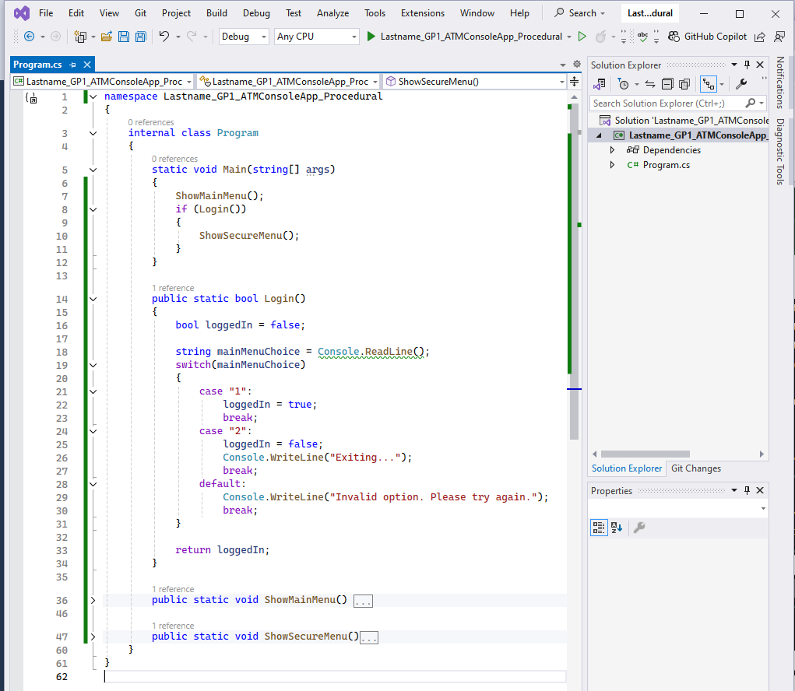

# GP1_ATMConsoleApp
Guided Project 1 - ATM Console App (Procedural)

### Task Preview


### Details (Task 2 - Control Menu Display)
💡 In this task, the ATM console app is updated with a login feature and control menus. Users can either insert their ATM card or exit the app. If they insert the card, they access a secure menu for balance checks, cash deposits, or withdrawals. This update ensures users log in before accessing secure options and simplifies menu navigation and user input handling.

1. Replace Code in Program.cs:
```csharp
namespace Lastname_GP1_ATMConsoleApp_Procedural
{
    internal class Program
    {
        static void Main(string[] args)
        {
            ShowMainMenu();
            if (Login())
            {
                ShowSecureMenu();
            }
        }

        public static bool Login()
        {
            bool loggedIn = false;

            string mainMenuChoice = Console.ReadLine();
            switch(mainMenuChoice)
            {
                case "1": 
                    loggedIn = true; 
                    break;
                case "2": 
                    loggedIn = false;
                    Console.WriteLine("Exiting...");
                    break;
                default:
                    Console.WriteLine("Invalid option. Please try again.");
                    break;
            }

            return loggedIn;
        }

        public static void ShowMainMenu(){...}

        public static void ShowSecureMenu(){...}
    }
}

```

2. Build and Run:
    - Save your changes by clicking File > Save All.
    - Build your project by going to the Build menu and selecting Build Solution.
    - Run the application by clicking the Start button (green play arrow) or pressing F5.

3. Test the Application:
    - The console will first show the main menu. Choose option "1" to simulate inserting an ATM card.
    - If you choose "1", you will be logged in and see the secure menu.
    - If you choose "2", the application will display "Exiting..." and close.

4. Verify:
    - Ensure the menus display correctly and that selecting options navigates appropriately. The login logic should correctly handle valid and invalid options.

### Next Task
Continue with the third part of this guided project: [Next 3. Populate Demo CardHolders](https://github.com/clydeatmcm/GP1_ATMConsoleApp/blob/3.-Populate-Demo-CardHolders/README.md)

### Guided Project Tasks

- [ ] [1. Setup Project](https://github.com/clydeatmcm/GP1_ATMConsoleApp/blob/1.-Setup-Project/README.md)
- [ ] [2. Control Menu Display](https://github.com/clydeatmcm/GP1_ATMConsoleApp/blob/2.-Control-Menu-Display/README.md)
- [ ] [3. Populate Demo CardHolders](https://github.com/clydeatmcm/GP1_ATMConsoleApp/blob/3.-Populate-Demo-CardHolders/README.md)
- [ ] [4. Implement Balance Enquiry](https://github.com/clydeatmcm/GP1_ATMConsoleApp/blob/4.-Implement-Balance-Enquiry/README.md)
- [ ] [5. Implement Cash Deposit](https://github.com/clydeatmcm/GP1_ATMConsoleApp/blob/5.-Implement-Cash-Deposit/README.md)
- [ ] [6. Implement Withdrawal](https://github.com/clydeatmcm/GP1_ATMConsoleApp/blob/6.-Implement-Withdrawal/README.md)
- [ ] [7. Implement Transactions](https://github.com/clydeatmcm/GP1_ATMConsoleApp/blob/7.-Implement-Transactions/README.md) 
